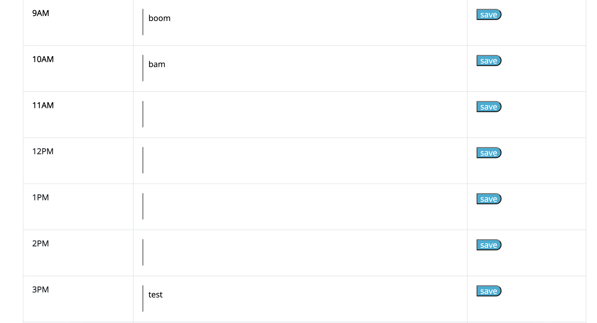
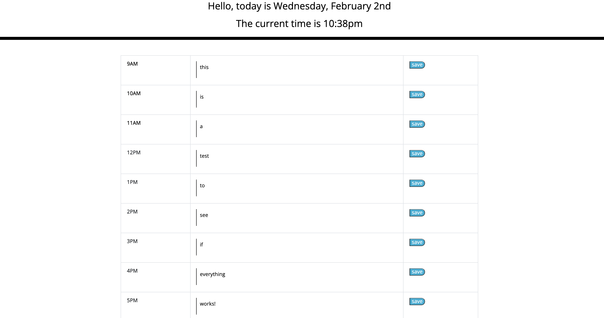
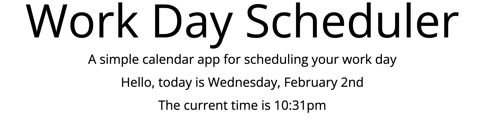
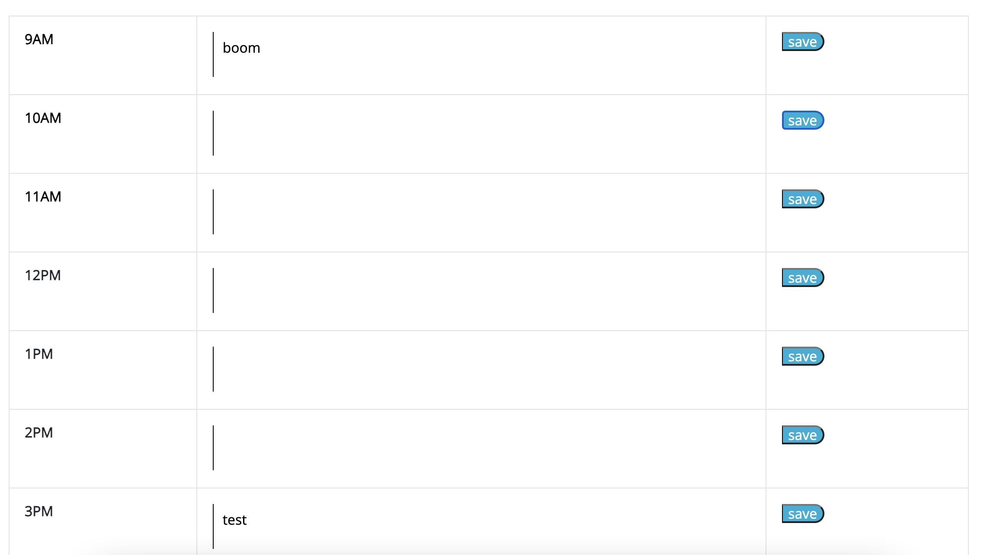

# Work-Day-Scheduler-05
https://bballplayer33.github.io/Work-Day-Scheduler-05/

## Discribtion
  Create a day planner that user can interact with and also changes color as the hour passes, also the user can save events in the text box.

## Usage

  *Saved data. 

  *All text boxes filled. 

  *Showing time and date. 

  *Showing saved deleted fields. 

## Conclusion
  I was able to save events to local storage, still working on the coloring changing with the hour as the time goes. Biggest challenge was figuring out the for loop and getting the arrays. 
